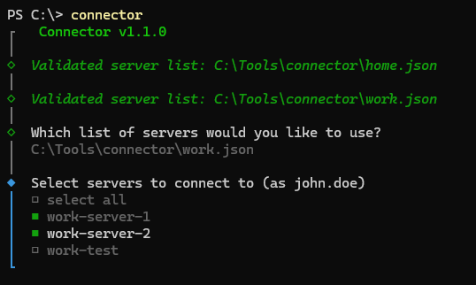

# connector

<h2 align="center">Connect to all your network drives from one place.</h2>

[](https://github.com/petrsapak/connector)
[](https://github.com/petrsapak/connector/blob/main/LICENSE)

Connector is a CLI tool for convenient SMB mapping creation. Supports Windows and Linux. Based on [](https://github.com/fadeevab/cliclack).


### Installation

#### Windows
The tool consists of a single executable file: connector.exe. Simply place it in any preferred location on your system.
#### Linux
Documentation is planned. (Coming soon.)

### Initial Setup
When you launch the tool for the first time, an initial setup wizard will assist you in:

- Adding the tool to your system's PATH

- Creating a list of network drives

Each list can include multiple drive mappings, and you can create multiple such lists to suit different use cases.

### Manual Configuration
For larger or more complex sets of drive mappings, it's recommended to create the configuration file manually. The file is written in JSON and follows a simple, intuitive structure.

```json
{
  "mount_target": "/mnt/smb",         // The base directory where all shares will be mounted (linux)
  "servers": [
    {
      "description": "",              // Optional: A friendly description of the server
      "name": "192.168.0.1\\movies",  // Server hostname or alias (e.g., movies.local or IP)
      "shares": []                    // List of share names to mount from this server (linux)
    },
    {
      "description": "",
      "name": "192.168.0.1\\music",
      "shares": []
    },
    {
      "description": "",
      "name": "192.168.0.1\\photos",
      "shares": []
    }
  ],
  "username": "john.doe"              // Username used to authenticate with the network shares
}
```


### Connector in Action

